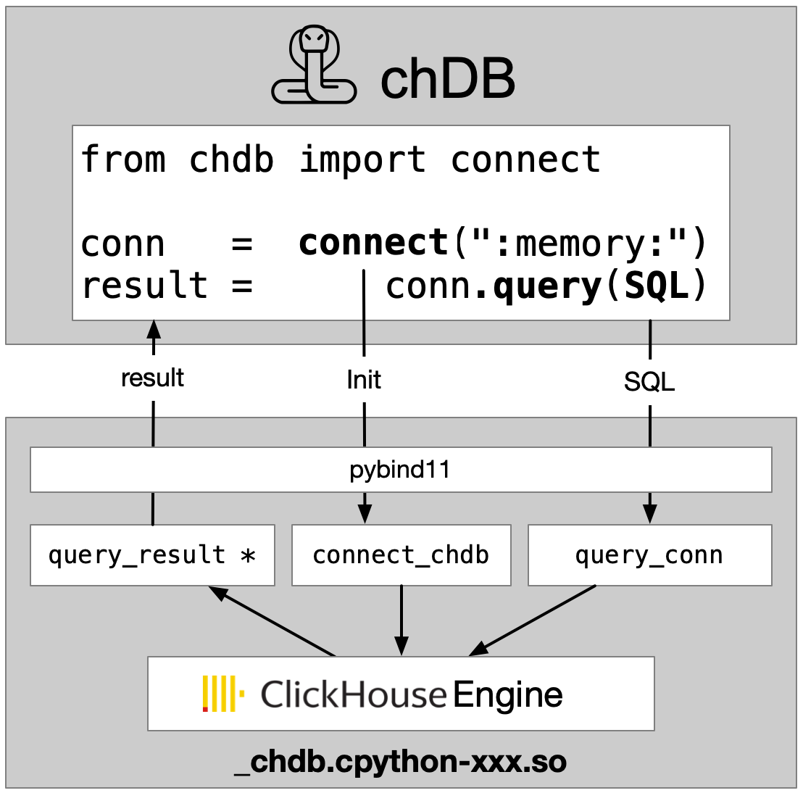

<div align="center">
   <a href="https://clickhouse.com/blog/chdb-joins-clickhouse-family">📢 chDB joins the ClickHouse family 🐍+🚀</a>
</div>
<div align="center">
<picture>
  <source media="(prefers-color-scheme: dark)" srcset="docs/_static/snake-chdb-dark.png" height="130">
  
</picture>

[](https://github.com/chdb-io/chdb/actions/workflows/build_linux_x86_wheels.yml)
[](https://pypi.org/project/chdb/)
[](https://pepy.tech/project/chdb)
[](https://discord.gg/D2Daa2fM5K)
[](https://twitter.com/chdb_io)
</div>

# chDB

[English](README.md)

> chDB 是一个由 ClickHouse 驱动的嵌入式 SQL OLAP 引擎。更多细节：[chDB: ClickHouse as a Function](https://zhuanlan.zhihu.com/p/642345300)


## 特点
     
* 嵌入在 Python 中的 SQL OLAP 引擎，由 ClickHouse 驱动
* 不需要安装 ClickHouse
* 支持 Parquet、CSV、JSON、Arrow、ORC 和其他 60 多种格式的[输入输出](https://clickhouse.com/docs/en/interfaces/formats)，[示例](tests/format_output.py)。
* 支持 Python DB API 2.0 标准, [example](examples/dbapi.py)

## 架构
<div align="center">
  
</div>

## 安装方式
目前，chDB 只支持在 macOS（x86_64 和 ARM64）和 Linux 上的 Python 3.8+。
```bash
pip install chdb
```

## 用法

### 在命令行中运行
> `python3 -m chdb SQL [OutputFormat]`
```bash
python3 -m chdb "SELECT 1,'abc'" Pretty
```


有三种使用 chdb 的方法：“原始文件查询（性能）”、“高级查询（推荐）”和“DB-API”：
<details>
    <summary><h4>🗂️ 原始文件查询</h4>（Parquet、CSV、JSON、Arrow、ORC 等 60 多种格式）</summary>

您可以执行 SQL 并返回所需格式的数据。

```python
import chdb
res = chdb.query('select version()', 'Pretty'); print(res)
```

### 使用 Parquet 或 CSV
```python
# 查看更多数据类型格式，请参见 tests/format_output.py
res = chdb.query('select * from file("data.parquet", Parquet)', 'JSON'); print(res)
res = chdb.query('select * from file("data.csv", CSV)', 'CSV');  print(res)
print(f"SQL read {res.rows_read()} rows, {res.bytes_read()} bytes, elapsed {res.elapsed()} seconds")
```

### Pandas DataFrame 输出
```python
# 更多内容请参见 https://clickhouse.com/docs/en/interfaces/formats
chdb.query('select * from file("data.parquet", Parquet)', 'Dataframe')
```
</details>

<details>
    <summary><h4>🗂️ 高级查询</h4>（Pandas DataFrame、Parquet 文件/字节、Arrow 文件/字节）</summary>

### 查询 Pandas DataFrame
```python
import chdb.dataframe as cdf
import pandas as pd
# Join 2 DataFrames
df1 = pd.DataFrame({'a': [1, 2, 3], 'b': ["one", "two", "three"]})
df2 = pd.DataFrame({'c': [1, 2, 3], 'd': ["①", "②", "③"]})
ret_tbl = cdf.query(sql="select * from __tbl1__ t1 join __tbl2__ t2 on t1.a = t2.c",
                  tbl1=df1, tbl2=df2)
print(ret_tbl)
# Query on the DataFrame Table
print(ret_tbl.query('select b, sum(a) from __table__ group by b'))
```
</details>

<details>
  <summary><h4>🗂️ 基于有状态会话 Session 查询</h4></summary>

```python
from chdb import session as chs

## 在临时会话中创建DB, Table, View，当会话被删除时自动清除。
sess = chs.Session()
sess.query("CREATE DATABASE IF NOT EXISTS db_xxx ENGINE = Atomic")
sess.query("CREATE TABLE IF NOT EXISTS db_xxx.log_table_xxx (x String, y Int) ENGINE = Log;")
sess.query("INSERT INTO db_xxx.log_table_xxx VALUES ('a', 1), ('b', 3), ('c', 2), ('d', 5);")
sess.query(
    "CREATE VIEW db_xxx.view_xxx AS SELECT * FROM db_xxx.log_table_xxx LIMIT 4;"
)
print("Select from view:\n")
print(sess.query("SELECT * FROM db_xxx.view_xxx", "Pretty"))
```

参见: [test_stateful.py](tests/test_stateful.py)
</details>

<details>
    <summary><h4>🗂️ Python DB-API 2.0</h4></summary>

```python
import chdb.dbapi as dbapi
print("chdb driver version: {0}".format(dbapi.get_client_info()))

conn1 = dbapi.connect()
cur1 = conn1.cursor()
cur1.execute('select version()')
print("description: ", cur1.description)
print("data: ", cur1.fetchone())
cur1.close()
conn1.close()
```
</details>

<details>
    <summary><h4>🗂️ Query with UDF(User Defined Functions)</h4></summary>

```python
from chdb.udf import chdb_udf
from chdb import query

@chdb_udf()
def sum_udf(lhs, rhs):
    return int(lhs) + int(rhs)

print(query("select sum_udf(12,22)"))
```

参见: [test_udf.py](tests/test_udf.py).
</details>

<details>
    <summary><h4>🗂️ 流式查询</h4></summary>

通过分块流式处理大数据集，保持内存使用恒定。

```python
from chdb import session as chs

sess = chs.Session()

# 示例1：流式查询基础用法
rows_cnt = 0
with sess.send_query("SELECT * FROM numbers(200000)", "CSV") as stream_result:
    for chunk in stream_result:
        rows_cnt += chunk.rows_read()

print(rows_cnt) # 200000

# 示例2：使用fetch()手动迭代
rows_cnt = 0
stream_result = sess.send_query("SELECT * FROM numbers(200000)", "CSV")
while True:
    chunk = stream_result.fetch()
    if chunk is None:
        break
    rows_cnt += chunk.rows_read()

print(rows_cnt) # 200000

# 示例3：提前取消查询
rows_cnt = 0
stream_result = sess.send_query("SELECT * FROM numbers(200000)", "CSV")
while True:
    chunk = stream_result.fetch()
    if chunk is None:
        break
    if rows_cnt > 0:
        stream_result.cancel()
        break
    rows_cnt += chunk.rows_read()

print(rows_cnt) # 65409

sess.close()
```

参见: [test_streaming_query.py](tests/test_streaming_query.py)。
</details>

更多示例，请参见 [examples](examples) 和 [tests](tests)。

## 演示和示例

- [Colab Notebook](https://colab.research.google.com/drive/1-zKB6oKfXeptggXi0kUX87iR8ZTSr4P3?usp=sharing) 和更多 [示例](examples)

## 基准测试

- [ClickBench of embedded engines](https://benchmark.clickhouse.com/#eyJzeXN0ZW0iOnsiQXRoZW5hIChwYXJ0aXRpb25lZCkiOnRydWUsIkF0aGVuYSAoc2luZ2xlKSI6dHJ1ZSwiQXVyb3JhIGZvciBNeVNRTCI6dHJ1ZSwiQXVyb3JhIGZvciBQb3N0Z3JlU1FMIjp0cnVlLCJCeXRlSG91c2UiOnRydWUsImNoREIiOnRydWUsIkNpdHVzIjp0cnVlLCJjbGlja2hvdXNlLWxvY2FsIChwYXJ0aXRpb25lZCkiOnRydWUsImNsaWNraG91c2UtbG9jYWwgKHNpbmdsZSkiOnRydWUsIkNsaWNrSG91c2UiOnRydWUsIkNsaWNrSG91c2UgKHR1bmVkKSI6dHJ1ZSwiQ2xpY2tIb3VzZSAoenN0ZCkiOnRydWUsIkNsaWNrSG91c2UgQ2xvdWQiOnRydWUsIkNsaWNrSG91c2UgKHdlYikiOnRydWUsIkNyYXRlREIiOnRydWUsIkRhdGFiZW5kIjp0cnVlLCJEYXRhRnVzaW9uIChzaW5nbGUpIjp0cnVlLCJBcGFjaGUgRG9yaXMiOnRydWUsIkRydWlkIjp0cnVlLCJEdWNrREIgKFBhcnF1ZXQpIjp0cnVlLCJEdWNrREIiOnRydWUsIkVsYXN0aWNzZWFyY2giOnRydWUsIkVsYXN0aWNzZWFyY2ggKHR1bmVkKSI6ZmFsc2UsIkdyZWVucGx1bSI6dHJ1ZSwiSGVhdnlBSSI6dHJ1ZSwiSHlkcmEiOnRydWUsIkluZm9icmlnaHQiOnRydWUsIktpbmV0aWNhIjp0cnVlLCJNYXJpYURCIENvbHVtblN0b3JlIjp0cnVlLCJNYXJpYURCIjpmYWxzZSwiTW9uZXREQiI6dHJ1ZSwiTW9uZ29EQiI6dHJ1ZSwiTXlTUUwgKE15SVNBTSkiOnRydWUsIk15U1FMIjp0cnVlLCJQaW5vdCI6dHJ1ZSwiUG9zdGdyZVNRTCI6dHJ1ZSwiUG9zdGdyZVNRTCAodHVuZWQpIjpmYWxzZSwiUXVlc3REQiAocGFydGl0aW9uZWQpIjp0cnVlLCJRdWVzdERCIjp0cnVlLCJSZWRzaGlmdCI6dHJ1ZSwiU2VsZWN0REIiOnRydWUsIlNpbmdsZVN0b3JlIjp0cnVlLCJTbm93Zmxha2UiOnRydWUsIlNRTGl0ZSI6dHJ1ZSwiU3RhclJvY2tzIjp0cnVlLCJUaW1lc2NhbGVEQiAoY29tcHJlc3Npb24pIjp0cnVlLCJUaW1lc2NhbGVEQiI6dHJ1ZX0sInR5cGUiOnsic3RhdGVsZXNzIjpmYWxzZSwibWFuYWdlZCI6ZmFsc2UsIkphdmEiOmZhbHNlLCJjb2x1bW4tb3JpZW50ZWQiOmZhbHNlLCJDKysiOmZhbHNlLCJNeVNRTCBjb21wYXRpYmxlIjpmYWxzZSwicm93LW9yaWVudGVkIjpmYWxzZSwiQyI6ZmFsc2UsIlBvc3RncmVTUUwgY29tcGF0aWJsZSI6ZmFsc2UsIkNsaWNrSG91c2UgZGVyaXZhdGl2ZSI6ZmFsc2UsImVtYmVkZGVkIjp0cnVlLCJzZXJ2ZXJsZXNzIjpmYWxzZSwiUnVzdCI6ZmFsc2UsInNlYXJjaCI6ZmFsc2UsImRvY3VtZW50IjpmYWxzZSwidGltZS1zZXJpZXMiOmZhbHNlfSwibWFjaGluZSI6eyJzZXJ2ZXJsZXNzIjp0cnVlLCIxNmFjdSI6dHJ1ZSwiTCI6dHJ1ZSwiTSI6dHJ1ZSwiUyI6dHJ1ZSwiWFMiOnRydWUsImM2YS5tZXRhbCwgNTAwZ2IgZ3AyIjp0cnVlLCJjNmEuNHhsYXJnZSwgNTAwZ2IgZ3AyIjp0cnVlLCJjNS40eGxhcmdlLCA1MDBnYiBncDIiOnRydWUsIjE2IHRocmVhZHMiOnRydWUsIjIwIHRocmVhZHMiOnRydWUsIjI0IHRocmVhZHMiOnRydWUsIjI4IHRocmVhZHMiOnRydWUsIjMwIHRocmVhZHMiOnRydWUsIjQ4IHRocmVhZHMiOnRydWUsIjYwIHRocmVhZHMiOnRydWUsIm01ZC4yNHhsYXJnZSI6dHJ1ZSwiYzVuLjR4bGFyZ2UsIDIwMGdiIGdwMiI6dHJ1ZSwiYzZhLjR4bGFyZ2UsIDE1MDBnYiBncDIiOnRydWUsImRjMi44eGxhcmdlIjp0cnVlLCJyYTMuMTZ4bGFyZ2UiOnRydWUsInJhMy40eGxhcmdlIjp0cnVlLCJyYTMueGxwbHVzIjp0cnVlLCJTMjQiOnRydWUsIlMyIjp0cnVlLCIyWEwiOnRydWUsIjNYTCI6dHJ1ZSwiNFhMIjp0cnVlLCJYTCI6dHJ1ZX0sImNsdXN0ZXJfc2l6ZSI6eyIxIjp0cnVlLCIyIjp0cnVlLCI0Ijp0cnVlLCI4Ijp0cnVlLCIxNiI6dHJ1ZSwiMzIiOnRydWUsIjY0Ijp0cnVlLCIxMjgiOnRydWUsInNlcnZlcmxlc3MiOnRydWUsInVuZGVmaW5lZCI6dHJ1ZX0sIm1ldHJpYyI6ImhvdCIsInF1ZXJpZXMiOlt0cnVlLHRydWUsdHJ1ZSx0cnVlLHRydWUsdHJ1ZSx0cnVlLHRydWUsdHJ1ZSx0cnVlLHRydWUsdHJ1ZSx0cnVlLHRydWUsdHJ1ZSx0cnVlLHRydWUsdHJ1ZSx0cnVlLHRydWUsdHJ1ZSx0cnVlLHRydWUsdHJ1ZSx0cnVlLHRydWUsdHJ1ZSx0cnVlLHRydWUsdHJ1ZSx0cnVlLHRydWUsdHJ1ZSx0cnVlLHRydWUsdHJ1ZSx0cnVlLHRydWUsdHJ1ZSx0cnVlLHRydWUsdHJ1ZSx0cnVlXX0=)

- [chDB vs Pandas](https://colab.research.google.com/drive/1FogLujJ_-ds7RGurDrUnK-U0IW8a8Qd0)

- [Benchmark on DataFrame: chDB Pandas DuckDB Polars](https://benchmark.clickhouse.com/#eyJzeXN0ZW0iOnsiQWxsb3lEQiI6dHJ1ZSwiQWxsb3lEQiAodHVuZWQpIjp0cnVlLCJBdGhlbmEgKHBhcnRpdGlvbmVkKSI6dHJ1ZSwiQXRoZW5hIChzaW5nbGUpIjp0cnVlLCJBdXJvcmEgZm9yIE15U1FMIjp0cnVlLCJBdXJvcmEgZm9yIFBvc3RncmVTUUwiOnRydWUsIkJ5Q29uaXR5Ijp0cnVlLCJCeXRlSG91c2UiOnRydWUsImNoREIgKERhdGFGcmFtZSkiOnRydWUsImNoREIgKFBhcnF1ZXQsIHBhcnRpdGlvbmVkKSI6dHJ1ZSwiY2hEQiI6dHJ1ZSwiQ2l0dXMiOnRydWUsIkNsaWNrSG91c2UgQ2xvdWQgKGF3cykiOnRydWUsIkNsaWNrSG91c2UgQ2xvdWQgKGF6dXJlKSI6dHJ1ZSwiQ2xpY2tIb3VzZSBDbG91ZCAoZ2NwKSI6dHJ1ZSwiQ2xpY2tIb3VzZSAoZGF0YSBsYWtlLCBwYXJ0aXRpb25lZCkiOnRydWUsIkNsaWNrSG91c2UgKGRhdGEgbGFrZSwgc2luZ2xlKSI6dHJ1ZSwiQ2xpY2tIb3VzZSAoUGFycXVldCwgcGFydGl0aW9uZWQpIjp0cnVlLCJDbGlja0hvdXNlIChQYXJxdWV0LCBzaW5nbGUpIjp0cnVlLCJDbGlja0hvdXNlICh3ZWIpIjp0cnVlLCJDbGlja0hvdXNlIjp0cnVlLCJDbGlja0hvdXNlICh0dW5lZCkiOnRydWUsIkNsaWNrSG91c2UgKHR1bmVkLCBtZW1vcnkpIjp0cnVlLCJDbG91ZGJlcnJ5Ijp0cnVlLCJDcmF0ZURCIjp0cnVlLCJDcnVuY2h5IEJyaWRnZSBmb3IgQW5hbHl0aWNzIChQYXJxdWV0KSI6dHJ1ZSwiRGF0YWJlbmQiOnRydWUsIkRhdGFGdXNpb24gKFBhcnF1ZXQsIHBhcnRpdGlvbmVkKSI6dHJ1ZSwiRGF0YUZ1c2lvbiAoUGFycXVldCwgc2luZ2xlKSI6dHJ1ZSwiQXBhY2hlIERvcmlzIjp0cnVlLCJEcnVpZCI6dHJ1ZSwiRHVja0RCIChEYXRhRnJhbWUpIjp0cnVlLCJEdWNrREIgKFBhcnF1ZXQsIHBhcnRpdGlvbmVkKSI6dHJ1ZSwiRHVja0RCIjp0cnVlLCJFbGFzdGljc2VhcmNoIjp0cnVlLCJFbGFzdGljc2VhcmNoICh0dW5lZCkiOmZhbHNlLCJHbGFyZURCIjp0cnVlLCJHcmVlbnBsdW0iOnRydWUsIkhlYXZ5QUkiOnRydWUsIkh5ZHJhIjp0cnVlLCJJbmZvYnJpZ2h0Ijp0cnVlLCJLaW5ldGljYSI6dHJ1ZSwiTWFyaWFEQiBDb2x1bW5TdG9yZSI6dHJ1ZSwiTWFyaWFEQiI6ZmFsc2UsIk1vbmV0REIiOnRydWUsIk1vbmdvREIiOnRydWUsIk1vdGhlcmR1Y2siOnRydWUsIk15U1FMIChNeUlTQU0pIjp0cnVlLCJNeVNRTCI6dHJ1ZSwiT3hsYSI6dHJ1ZSwiUGFuZGFzIChEYXRhRnJhbWUpIjp0cnVlLCJQYXJhZGVEQiAoUGFycXVldCwgcGFydGl0aW9uZWQpIjp0cnVlLCJQYXJhZGVEQiAoUGFycXVldCwgc2luZ2xlKSI6dHJ1ZSwiUGlub3QiOnRydWUsIlBvbGFycyAoRGF0YUZyYW1lKSI6dHJ1ZSwiUG9zdGdyZVNRTCAodHVuZWQpIjpmYWxzZSwiUG9zdGdyZVNRTCI6dHJ1ZSwiUXVlc3REQiAocGFydGl0aW9uZWQpIjp0cnVlLCJRdWVzdERCIjp0cnVlLCJSZWRzaGlmdCI6dHJ1ZSwiU2luZ2xlU3RvcmUiOnRydWUsIlNub3dmbGFrZSI6dHJ1ZSwiU1FMaXRlIjp0cnVlLCJTdGFyUm9ja3MiOnRydWUsIlRhYmxlc3BhY2UiOnRydWUsIlRlbWJvIE9MQVAgKGNvbHVtbmFyKSI6dHJ1ZSwiVGltZXNjYWxlREIgKGNvbXByZXNzaW9uKSI6dHJ1ZSwiVGltZXNjYWxlREIiOnRydWUsIlVtYnJhIjp0cnVlfSwidHlwZSI6eyJDIjpmYWxzZSwiY29sdW1uLW9yaWVudGVkIjpmYWxzZSwiUG9zdGdyZVNRTCBjb21wYXRpYmxlIjpmYWxzZSwibWFuYWdlZCI6ZmFsc2UsImdjcCI6ZmFsc2UsInN0YXRlbGVzcyI6ZmFsc2UsIkphdmEiOmZhbHNlLCJDKysiOmZhbHNlLCJNeVNRTCBjb21wYXRpYmxlIjpmYWxzZSwicm93LW9yaWVudGVkIjpmYWxzZSwiQ2xpY2tIb3VzZSBkZXJpdmF0aXZlIjpmYWxzZSwiZW1iZWRkZWQiOmZhbHNlLCJzZXJ2ZXJsZXNzIjpmYWxzZSwiZGF0YWZyYW1lIjp0cnVlLCJhd3MiOmZhbHNlLCJhenVyZSI6ZmFsc2UsImFuYWx5dGljYWwiOmZhbHNlLCJSdXN0IjpmYWxzZSwic2VhcmNoIjpmYWxzZSwiZG9jdW1lbnQiOmZhbHNlLCJzb21ld2hhdCBQb3N0Z3JlU1FMIGNvbXBhdGlibGUiOmZhbHNlLCJ0aW1lLXNlcmllcyI6ZmFsc2V9LCJtYWNoaW5lIjp7IjE2IHZDUFUgMTI4R0IiOnRydWUsIjggdkNQVSA2NEdCIjp0cnVlLCJzZXJ2ZXJsZXNzIjp0cnVlLCIxNmFjdSI6dHJ1ZSwiYzZhLjR4bGFyZ2UsIDUwMGdiIGdwMiI6dHJ1ZSwiTCI6dHJ1ZSwiTSI6dHJ1ZSwiUyI6dHJ1ZSwiWFMiOnRydWUsImM2YS5tZXRhbCwgNTAwZ2IgZ3AyIjp0cnVlLCIxOTJHQiI6dHJ1ZSwiMjRHQiI6dHJ1ZSwiMzYwR0IiOnRydWUsIjQ4R0IiOnRydWUsIjcyMEdCIjp0cnVlLCI5NkdCIjp0cnVlLCJkZXYiOnRydWUsIjcwOEdCIjp0cnVlLCJjNW4uNHhsYXJnZSwgNTAwZ2IgZ3AyIjp0cnVlLCJBbmFseXRpY3MtMjU2R0IgKDY0IHZDb3JlcywgMjU2IEdCKSI6dHJ1ZSwiYzUuNHhsYXJnZSwgNTAwZ2IgZ3AyIjp0cnVlLCJjNmEuNHhsYXJnZSwgMTUwMGdiIGdwMiI6dHJ1ZSwiY2xvdWQiOnRydWUsImRjMi44eGxhcmdlIjp0cnVlLCJyYTMuMTZ4bGFyZ2UiOnRydWUsInJhMy40eGxhcmdlIjp0cnVlLCJyYTMueGxwbHVzIjp0cnVlLCJTMiI6dHJ1ZSwiUzI0Ijp0cnVlLCIyWEwiOnRydWUsIjNYTCI6dHJ1ZSwiNFhMIjp0cnVlLCJYTCI6dHJ1ZSwiTDEgLSAxNkNQVSAzMkdCIjp0cnVlLCJjNmEuNHhsYXJnZSwgNTAwZ2IgZ3AzIjp0cnVlfSwiY2x1c3Rlcl9zaXplIjp7IjEiOnRydWUsIjIiOnRydWUsIjQiOnRydWUsIjgiOnRydWUsIjE2Ijp0cnVlLCIzMiI6dHJ1ZSwiNjQiOnRydWUsIjEyOCI6dHJ1ZSwic2VydmVybGVzcyI6dHJ1ZX0sIm1ldHJpYyI6ImhvdCIsInF1ZXJpZXMiOlt0cnVlLHRydWUsdHJ1ZSx0cnVlLHRydWUsdHJ1ZSx0cnVlLHRydWUsdHJ1ZSx0cnVlLHRydWUsdHJ1ZSx0cnVlLHRydWUsdHJ1ZSx0cnVlLHRydWUsdHJ1ZSx0cnVlLHRydWUsdHJ1ZSx0cnVlLHRydWUsdHJ1ZSx0cnVlLHRydWUsdHJ1ZSx0cnVlLHRydWUsdHJ1ZSx0cnVlLHRydWUsdHJ1ZSx0cnVlLHRydWUsdHJ1ZSx0cnVlLHRydWUsdHJ1ZSx0cnVlLHRydWUsdHJ1ZSx0cnVlXX0=)


<div align="center">
    
</div>

## 文档
- 关于 SQL 语法，请参考 [ClickHouse SQL 参考](https://clickhouse.com/docs/en/sql-reference/syntax)


## 贡献
贡献是使开源社区成为一个学习、激励和创造的绝佳场所的原因。您做出的任何贡献都将受到**高度赞赏**。
以下是您可以提供帮助的事项：
- 「Star」和「分享」
- [ ] 帮助测试和报告错误
- [ ] 帮助改进文档
- [ ] 帮助提高代码质量和性能

## 事件

- Demo chDB at [ClickHouse v23.7 livehouse!](https://t.co/todc13Kn19) and [Slides](https://docs.google.com/presentation/d/1ikqjOlimRa7QAg588TAB_Fna-Tad2WMg7_4AgnbQbFA/edit?usp=sharing)

## 版本说明

请查看 [VERSION-GUIDE.md](VERSION-GUIDE.md) 获取更多信息。

## 相关论文

- [ClickHouse - Lightning Fast Analytics for Everyone](https://www.vldb.org/pvldb/vol17/p3731-schulze.pdf)

## 版权信息
Apache 2.0，请查看 [LICENSE](LICENSE.txt) 获取更多信息。

## 鸣谢
chDB 主要基于 [ClickHouse](https://github.com/ClickHouse/ClickHouse)。由于商标和其他原因，我将其命名为 chDB。

## 联系方式
- 知乎: [@auxten](https://www.zhihu.com/people/auxten)
- Discord：[https://discord.gg/D2Daa2fM5K](https://discord.gg/D2Daa2fM5K)
- 电子邮件：auxten@clickhouse.com
- Twitter：[@chdb](https://twitter.com/chdb_io)
