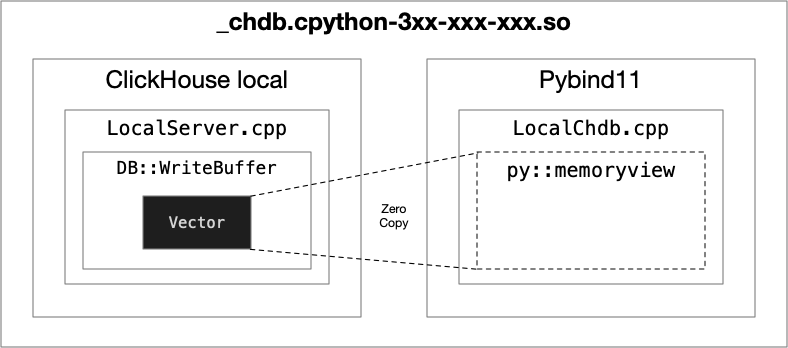

<div align="center">
  
</div>

[](https://github.com/auxten/chdb/actions/workflows/build_wheels.yml)
[](https://pypi.org/project/chdb/)
[](https://pepy.tech/project/chdb)
[](https://discord.gg/Njw5YXSPPc)
[](https://twitter.com/auxten)

# chDB

[English](README.md)

> chDB 是一个由 ClickHouse 驱动的嵌入式 SQL OLAP 引擎


## 特点
     
* 嵌入在 Python 中的 SQL OLAP 引擎，由 ClickHouse 驱动
* 不需要安装 ClickHouse
* 支持 Parquet、CSV、JSON、Arrow、ORC 和其他 60 多种格式的[输入输出](https://clickhouse.com/docs/en/interfaces/formats)，[示例](tests/format_output.py)。
* 支持 Python DB API 2.0 标准, [example](examples/dbapi.py)

## 架构
<div align="center">
  
</div>

## 安装方式
目前，chDB 只支持在 macOS（x86_64 和 ARM64）和 Linux 上的 Python 3.8+。
```bash
pip install chdb
```

## 用法

### 在命令行中运行
> `python3 -m chdb SQL [OutputFormat]`
```bash
python3 -m chdb "SELECT 1,'abc'" Pretty
```


有三种使用 chdb 的方法：“原始文件查询（性能）”、“高级查询（推荐）”和“DB-API”：
<details>
    <summary><h4>🗂️ 原始文件查询</h4>（Parquet、CSV、JSON、Arrow、ORC 等 60 多种格式）</summary>

您可以执行 SQL 并返回所需格式的数据。

```python
import chdb
res = chdb.query('select version()', 'Pretty'); print(res.data())
```

### 使用 Parquet 或 CSV
```python
# 查看更多数据类型格式，请参见 tests/format_output.py
res = chdb.query('select * from file("data.parquet", Parquet)', 'JSON'); print(res.data())
# 对于大型数据结果，get_memview() 更快，因为它不需要额外的数据复制。
res = chdb.query('select * from file("data.csv", CSV)', 'CSV');  print(str(res.get_memview().tobytes()))
```

### Pandas DataFrame 输出
```python
# 更多内容请参见 https://clickhouse.com/docs/en/interfaces/formats
chdb.query('select * from file("data.parquet", Parquet)', 'Dataframe')
```
</details>

<details>
    <summary><h4>🗂️ 高级查询</h4>（Pandas DataFrame、Parquet 文件/字节、Arrow 文件/字节）</summary>

### 查询 Pandas DataFrame
```python
import chdb.dataframe as cdf
import pandas as pd
tbl = cdf.Table(dataframe=pd.DataFrame({'a': [1, 2, 3], 'b': ['a', 'b', 'c']}))
ret_tbl = tbl.query('select * from __table__')
print(ret_tbl)
print(ret_tbl.query('select b, sum(a) from __table__ group by b'))
```
</details>

<details>
    <summary><h4>🗂️ Python DB-API 2.0</h4></summary>

```python
import chdb.dbapi as dbapi
print("chdb driver version: {0}".format(dbapi.get_client_info()))

conn1 = dbapi.connect()
cur1 = conn1.cursor()
cur1.execute('select version()')
print("description: ", cur1.description)
print("data: ", cur1.fetchone())
cur1.close()
conn1.close()
```
</details>

更多示例，请参见 [examples](examples) 和 [tests](tests)。

## 演示和示例

- [示例目录](examples)
- [Server Less查询演示](https://chdb.fly.dev/?user=default#Ly8gaHR0cHM6Ly9naXRodWIuY29tL21ldHJpY28vY2hkYi1zZXJ2ZXIKU0VMRUNUCiAgICB0b3duLAogICAgZGlzdHJpY3QsCiAgICBjb3VudCgpIEFTIGMsCiAgICByb3VuZChhdmcocHJpY2UpKSBBUyBwcmljZQpGUk9NIHVybCgnaHR0cHM6Ly9kYXRhc2V0cy1kb2N1bWVudGF0aW9uLnMzLmV1LXdlc3QtMy5hbWF6b25hd3MuY29tL2hvdXNlX3BhcnF1ZXQvaG91c2VfMC5wYXJxdWV0JykKR1JPVVAgQlkKICAgIHRvd24sCiAgICBkaXN0cmljdApMSU1JVCAxMA==)

## 基准测试

- [嵌入式引擎的 ClickBench](https://benchmark.clickhouse.com/#eyJzeXN0ZW0iOnsiQXRoZW5hIChwYXJ0aXRpb25lZCkiOnRydWUsIkF0aGVuYSAoc2luZ2xlKSI6dHJ1ZSwiQXVyb3JhIGZvciBNeVNRTCI6dHJ1ZSwiQXVyb3JhIGZvciBQb3N0Z3JlU1FMIjp0cnVlLCJCeXRlSG91c2UiOnRydWUsImNoREIiOnRydWUsIkNpdHVzIjp0cnVlLCJjbGlja2hvdXNlLWxvY2FsIChwYXJ0aXRpb25lZCkiOnRydWUsImNsaWNraG91c2UtbG9jYWwgKHNpbmdsZSkiOnRydWUsIkNsaWNrSG91c2UiOnRydWUsIkNsaWNrSG91c2UgKHR1bmVkKSI6dHJ1ZSwiQ2xpY2tIb3VzZSAoenN0ZCkiOnRydWUsIkNsaWNrSG91c2UgQ2xvdWQiOnRydWUsIkNsaWNrSG91c2UgKHdlYikiOnRydWUsIkNyYXRlREIiOnRydWUsIkRhdGFiZW5kIjp0cnVlLCJEYXRhRnVzaW9uIChzaW5nbGUpIjp0cnVlLCJBcGFjaGUgRG9yaXMiOnRydWUsIkRydWlkIjp0cnVlLCJEdWNrREIgKFBhcnF1ZXQpIjp0cnVlLCJEdWNrREIiOnRydWUsIkVsYXN0aWNzZWFyY2giOnRydWUsIkVsYXN0aWNzZWFyY2ggKHR1bmVkKSI6ZmFsc2UsIkdyZWVucGx1bSI6dHJ1ZSwiSGVhdnlBSSI6dHJ1ZSwiSHlkcmEiOnRydWUsIkluZm9icmlnaHQiOnRydWUsIktpbmV0aWNhIjp0cnVlLCJNYXJpYURCIENvbHVtblN0b3JlIjp0cnVlLCJNYXJpYURCIjpmYWxzZSwiTW9uZXREQiI6dHJ1ZSwiTW9uZ29EQiI6dHJ1ZSwiTXlTUUwgKE15SVNBTSkiOnRydWUsIk15U1FMIjp0cnVlLCJQaW5vdCI6dHJ1ZSwiUG9zdGdyZVNRTCI6dHJ1ZSwiUG9zdGdyZVNRTCAodHVuZWQpIjpmYWxzZSwiUXVlc3REQiAocGFydGl0aW9uZWQpIjp0cnVlLCJRdWVzdERCIjp0cnVlLCJSZWRzaGlmdCI6dHJ1ZSwiU2VsZWN0REIiOnRydWUsIlNpbmdsZVN0b3JlIjp0cnVlLCJTbm93Zmxha2UiOnRydWUsIlNRTGl0ZSI6dHJ1ZSwiU3RhclJvY2tzIjp0cnVlLCJUaW1lc2NhbGVEQiAoY29tcHJlc3Npb24pIjp0cnVlLCJUaW1lc2NhbGVEQiI6dHJ1ZX0sInR5cGUiOnsic3RhdGVsZXNzIjpmYWxzZSwibWFuYWdlZCI6ZmFsc2UsIkphdmEiOmZhbHNlLCJjb2x1bW4tb3JpZW50ZWQiOmZhbHNlLCJDKysiOmZhbHNlLCJNeVNRTCBjb21wYXRpYmxlIjpmYWxzZSwicm93LW9yaWVudGVkIjpmYWxzZSwiQyI6ZmFsc2UsIlBvc3RncmVTUUwgY29tcGF0aWJsZSI6ZmFsc2UsIkNsaWNrSG91c2UgZGVyaXZhdGl2ZSI6ZmFsc2UsImVtYmVkZGVkIjp0cnVlLCJzZXJ2ZXJsZXNzIjpmYWxzZSwiUnVzdCI6ZmFsc2UsInNlYXJjaCI6ZmFsc2UsImRvY3VtZW50IjpmYWxzZSwidGltZS1zZXJpZXMiOmZhbHNlfSwibWFjaGluZSI6eyJzZXJ2ZXJsZXNzIjp0cnVlLCIxNmFjdSI6dHJ1ZSwiTCI6dHJ1ZSwiTSI6dHJ1ZSwiUyI6dHJ1ZSwiWFMiOnRydWUsImM2YS5tZXRhbCwgNTAwZ2IgZ3AyIjp0cnVlLCJjNmEuNHhsYXJnZSwgNTAwZ2IgZ3AyIjp0cnVlLCJjNS40eGxhcmdlLCA1MDBnYiBncDIiOnRydWUsIjE2IHRocmVhZHMiOnRydWUsIjIwIHRocmVhZHMiOnRydWUsIjI0IHRocmVhZHMiOnRydWUsIjI4IHRocmVhZHMiOnRydWUsIjMwIHRocmVhZHMiOnRydWUsIjQ4IHRocmVhZHMiOnRydWUsIjYwIHRocmVhZHMiOnRydWUsIm01ZC4yNHhsYXJnZSI6dHJ1ZSwiYzVuLjR4bGFyZ2UsIDIwMGdiIGdwMiI6dHJ1ZSwiYzZhLjR4bGFyZ2UsIDE1MDBnYiBncDIiOnRydWUsImRjMi44eGxhcmdlIjp0cnVlLCJyYTMuMTZ4bGFyZ2UiOnRydWUsInJhMy40eGxhcmdlIjp0cnVlLCJyYTMueGxwbHVzIjp0cnVlLCJTMjQiOnRydWUsIlMyIjp0cnVlLCIyWEwiOnRydWUsIjNYTCI6dHJ1ZSwiNFhMIjp0cnVlLCJYTCI6dHJ1ZX0sImNsdXN0ZXJfc2l6ZSI6eyIxIjp0cnVlLCIyIjp0cnVlLCI0Ijp0cnVlLCI4Ijp0cnVlLCIxNiI6dHJ1ZSwiMzIiOnRydWUsIjY0Ijp0cnVlLCIxMjgiOnRydWUsInNlcnZlcmxlc3MiOnRydWUsInVuZGVmaW5lZCI6dHJ1ZX0sIm1ldHJpYyI6ImhvdCIsInF1ZXJpZXMiOlt0cnVlLHRydWUsdHJ1ZSx0cnVlLHRydWUsdHJ1ZSx0cnVlLHRydWUsdHJ1ZSx0cnVlLHRydWUsdHJ1ZSx0cnVlLHRydWUsdHJ1ZSx0cnVlLHRydWUsdHJ1ZSx0cnVlLHRydWUsdHJ1ZSx0cnVlLHRydWUsdHJ1ZSx0cnVlLHRydWUsdHJ1ZSx0cnVlLHRydWUsdHJ1ZSx0cnVlLHRydWUsdHJ1ZSx0cnVlLHRydWUsdHJ1ZSx0cnVlLHRydWUsdHJ1ZSx0cnVlLHRydWUsdHJ1ZSx0cnVlXX0=)

## 文档
- 关于 SQL 语法，请参考 [ClickHouse SQL 参考](https://clickhouse.com/docs/en/sql-reference/syntax)

## 贡献
贡献是使开源社区成为一个学习、激励和创造的绝佳场所的原因。您做出的任何贡献都将受到**高度赞赏**。
以下是您可以提供帮助的事项：
- [ ] 帮助我支持 Windows 平台，我不太了解 Windows 工具链。
- [x] Python 包装器目前只有一个 `query` 函数。我想添加更多函数，以使其使用更加方便，比如 `toPandas`，`toNumpy` 等等。

## 版权信息
Apache 2.0，请查看 [LICENSE](LICENSE.txt) 获取更多信息。

## 鸣谢
chDB 主要基于 [ClickHouse](https://github.com/ClickHouse/ClickHouse)。由于商标和其他原因，我将其命名为 chDB。

## 联系方式
- 知乎: [@auxten](https://www.zhihu.com/people/auxten)
- Discord：https://discord.gg/nqSkfJRR
- 电子邮件：auxtenwpc@gmail.com
- Twitter：[@auxten](https://twitter.com/auxten)
