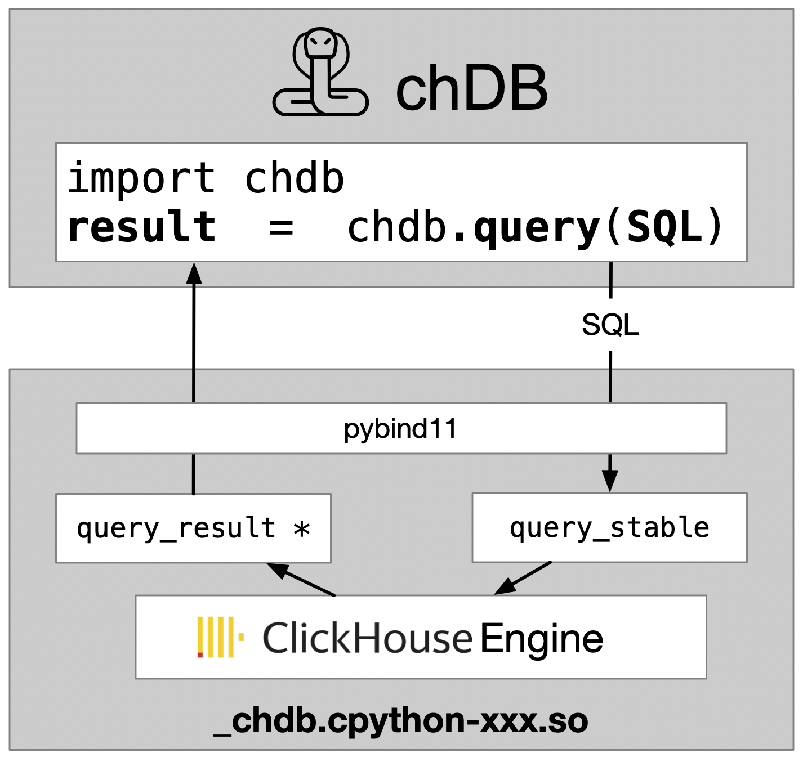

<div align="center">
<picture>
  <source media="(prefers-color-scheme: dark)" srcset="docs/_static/snake-chdb-dark.png" height="130">
  
</picture>

[](https://github.com/auxten/chdb/actions/workflows/build_wheels.yml)
[](https://pypi.org/project/chdb/)
[](https://pepy.tech/project/chdb)
[](https://discord.gg/D2Daa2fM5K)
[](https://twitter.com/auxten)
</div>

# chDB

[中文](README-zh.md)

> chDB is an embedded SQL OLAP Engine powered by ClickHouse  [^1]
> For more details: [The birth of chDB](https://auxten.com/the-birth-of-chdb/) 


## Features
     
* In-process SQL OLAP Engine, powered by ClickHouse
* No need to install ClickHouse
* Minimized data copy from C++ to Python with [python memoryview](https://docs.python.org/3/c-api/memoryview.html)
* Input&Output support Parquet, CSV, JSON, Arrow, ORC and 60+[more](https://clickhouse.com/docs/en/interfaces/formats) formats, [samples](tests/format_output.py)
* Support Python DB API 2.0, [example](examples/dbapi.py)


## Arch
<div align="center">
  
</div>

## Get Started
Get started with **chdb** using our [Installation and Usage Examples](https://doc.chdb.io)

<br>

## Installation
Currently, chDB supports Python 3.8+ on macOS and Linux (x86_64 and ARM64).
```bash
pip install chdb
```

## Usage

### Run in command line
> `python3 -m chdb SQL [OutputFormat]`
```bash
python3 -m chdb "SELECT 1,'abc'" Pretty
```

<br>

### Data Input
The following methods are available to access on-disk and in-memory data formats:

<details>
    <summary><h4>🗂️ Query On File</h4> (Parquet, CSV, JSON, Arrow, ORC and 60+)</summary>

You can execute SQL and return desired format data.

```python
import chdb
res = chdb.query('select version()', 'Pretty'); print(res)
```

### Work with Parquet or CSV
```python
# See more data type format in tests/format_output.py
res = chdb.query('select * from file("data.parquet", Parquet)', 'JSON'); print(res)
res = chdb.query('select * from file("data.csv", CSV)', 'CSV');  print(res)
print(f"SQL read {res.rows_read()} rows, {res.bytes_read()} bytes, elapsed {res.elapsed()} seconds")
```

### Pandas dataframe output
```python
# See more in https://clickhouse.com/docs/en/interfaces/formats
chdb.query('select * from file("data.parquet", Parquet)', 'Dataframe')
```
</details>

<details>
    <summary><h4>🗂️ Query On Table</h4> (Pandas DataFrame, Parquet file/bytes, Arrow bytes) </summary>

### Query On Pandas DataFrame
```python
import chdb.dataframe as cdf
import pandas as pd
# Join 2 DataFrames
df1 = pd.DataFrame({'a': [1, 2, 3], 'b': ["one", "two", "three"]})
df2 = pd.DataFrame({'c': [1, 2, 3], 'd': ["①", "②", "③"]})
ret_tbl = cdf.query(sql="select * from __tbl1__ t1 join __tbl2__ t2 on t1.a = t2.c",
                  tbl1=df1, tbl2=df2)
print(ret_tbl)
# Query on the DataFrame Table
print(ret_tbl.query('select b, sum(a) from __table__ group by b'))
```
</details>

<details>
  <summary><h4>🗂️ Query with Stateful Session</h4></summary>

```python
from chdb import session as chs

## Create DB, Table, View in temp session, auto cleanup when session is deleted.
sess = chs.Session()
sess.query("CREATE DATABASE IF NOT EXISTS db_xxx ENGINE = Atomic")
sess.query("CREATE TABLE IF NOT EXISTS db_xxx.log_table_xxx (x String, y Int) ENGINE = Log;")
sess.query("INSERT INTO db_xxx.log_table_xxx VALUES ('a', 1), ('b', 3), ('c', 2), ('d', 5);")
sess.query(
    "CREATE VIEW db_xxx.view_xxx AS SELECT * FROM db_xxx.log_table_xxx LIMIT 4;"
)
print("Select from view:\n")
print(sess.query("SELECT * FROM db_xxx.view_xxx", "Pretty"))
```

see also: [test_stateful.py](tests/test_stateful.py).
</details>

<details>
    <summary><h4>🗂️ Query with Python DB-API 2.0</h4></summary>

```python
import chdb.dbapi as dbapi
print("chdb driver version: {0}".format(dbapi.get_client_info()))

conn1 = dbapi.connect()
cur1 = conn1.cursor()
cur1.execute('select version()')
print("description: ", cur1.description)
print("data: ", cur1.fetchone())
cur1.close()
conn1.close()
```
</details>


<details>
    <summary><h4>🗂️ Query with UDF (User Defined Functions)</h4></summary>

```python
from chdb.udf import chdb_udf
from chdb import query

@chdb_udf()
def sum_udf(lhs, rhs):
    return int(lhs) + int(rhs)

print(query("select sum_udf(12,22)"))
```

see also: [test_udf.py](tests/test_udf.py).
</details>

For more examples, see [examples](examples) and [tests](tests).

<br>

## Demos and Examples

- [Project Documentation](https://chdb.dev) and [Usage Examples](https://chdb-io.github.io/#/install?id=installation-1)
- [Colab Notebooks](https://colab.research.google.com/drive/1-zKB6oKfXeptggXi0kUX87iR8ZTSr4P3?usp=sharing) and other [Script Examples](examples)
- [Public Serverless Demo](https://chdb.fly.dev/?user=default#Ly8gaHR0cHM6Ly9naXRodWIuY29tL21ldHJpY28vY2hkYi1zZXJ2ZXIKU0VMRUNUCiAgICB0b3duLAogICAgZGlzdHJpY3QsCiAgICBjb3VudCgpIEFTIGMsCiAgICByb3VuZChhdmcocHJpY2UpKSBBUyBwcmljZQpGUk9NIHVybCgnaHR0cHM6Ly9kYXRhc2V0cy1kb2N1bWVudGF0aW9uLnMzLmV1LXdlc3QtMy5hbWF6b25hd3MuY29tL2hvdXNlX3BhcnF1ZXQvaG91c2VfMC5wYXJxdWV0JykKR1JPVVAgQlkKICAgIHRvd24sCiAgICBkaXN0cmljdApMSU1JVCAxMA==) running on fly.io

## Benchmark

- [ClickBench of embedded engines](https://benchmark.clickhouse.com/#eyJzeXN0ZW0iOnsiQXRoZW5hIChwYXJ0aXRpb25lZCkiOnRydWUsIkF0aGVuYSAoc2luZ2xlKSI6dHJ1ZSwiQXVyb3JhIGZvciBNeVNRTCI6dHJ1ZSwiQXVyb3JhIGZvciBQb3N0Z3JlU1FMIjp0cnVlLCJCeXRlSG91c2UiOnRydWUsImNoREIiOnRydWUsIkNpdHVzIjp0cnVlLCJjbGlja2hvdXNlLWxvY2FsIChwYXJ0aXRpb25lZCkiOnRydWUsImNsaWNraG91c2UtbG9jYWwgKHNpbmdsZSkiOnRydWUsIkNsaWNrSG91c2UiOnRydWUsIkNsaWNrSG91c2UgKHR1bmVkKSI6dHJ1ZSwiQ2xpY2tIb3VzZSAoenN0ZCkiOnRydWUsIkNsaWNrSG91c2UgQ2xvdWQiOnRydWUsIkNsaWNrSG91c2UgKHdlYikiOnRydWUsIkNyYXRlREIiOnRydWUsIkRhdGFiZW5kIjp0cnVlLCJEYXRhRnVzaW9uIChzaW5nbGUpIjp0cnVlLCJBcGFjaGUgRG9yaXMiOnRydWUsIkRydWlkIjp0cnVlLCJEdWNrREIgKFBhcnF1ZXQpIjp0cnVlLCJEdWNrREIiOnRydWUsIkVsYXN0aWNzZWFyY2giOnRydWUsIkVsYXN0aWNzZWFyY2ggKHR1bmVkKSI6ZmFsc2UsIkdyZWVucGx1bSI6dHJ1ZSwiSGVhdnlBSSI6dHJ1ZSwiSHlkcmEiOnRydWUsIkluZm9icmlnaHQiOnRydWUsIktpbmV0aWNhIjp0cnVlLCJNYXJpYURCIENvbHVtblN0b3JlIjp0cnVlLCJNYXJpYURCIjpmYWxzZSwiTW9uZXREQiI6dHJ1ZSwiTW9uZ29EQiI6dHJ1ZSwiTXlTUUwgKE15SVNBTSkiOnRydWUsIk15U1FMIjp0cnVlLCJQaW5vdCI6dHJ1ZSwiUG9zdGdyZVNRTCI6dHJ1ZSwiUG9zdGdyZVNRTCAodHVuZWQpIjpmYWxzZSwiUXVlc3REQiAocGFydGl0aW9uZWQpIjp0cnVlLCJRdWVzdERCIjp0cnVlLCJSZWRzaGlmdCI6dHJ1ZSwiU2VsZWN0REIiOnRydWUsIlNpbmdsZVN0b3JlIjp0cnVlLCJTbm93Zmxha2UiOnRydWUsIlNRTGl0ZSI6dHJ1ZSwiU3RhclJvY2tzIjp0cnVlLCJUaW1lc2NhbGVEQiAoY29tcHJlc3Npb24pIjp0cnVlLCJUaW1lc2NhbGVEQiI6dHJ1ZX0sInR5cGUiOnsic3RhdGVsZXNzIjpmYWxzZSwibWFuYWdlZCI6ZmFsc2UsIkphdmEiOmZhbHNlLCJjb2x1bW4tb3JpZW50ZWQiOmZhbHNlLCJDKysiOmZhbHNlLCJNeVNRTCBjb21wYXRpYmxlIjpmYWxzZSwicm93LW9yaWVudGVkIjpmYWxzZSwiQyI6ZmFsc2UsIlBvc3RncmVTUUwgY29tcGF0aWJsZSI6ZmFsc2UsIkNsaWNrSG91c2UgZGVyaXZhdGl2ZSI6ZmFsc2UsImVtYmVkZGVkIjp0cnVlLCJzZXJ2ZXJsZXNzIjpmYWxzZSwiUnVzdCI6ZmFsc2UsInNlYXJjaCI6ZmFsc2UsImRvY3VtZW50IjpmYWxzZSwidGltZS1zZXJpZXMiOmZhbHNlfSwibWFjaGluZSI6eyJzZXJ2ZXJsZXNzIjp0cnVlLCIxNmFjdSI6dHJ1ZSwiTCI6dHJ1ZSwiTSI6dHJ1ZSwiUyI6dHJ1ZSwiWFMiOnRydWUsImM2YS5tZXRhbCwgNTAwZ2IgZ3AyIjp0cnVlLCJjNmEuNHhsYXJnZSwgNTAwZ2IgZ3AyIjp0cnVlLCJjNS40eGxhcmdlLCA1MDBnYiBncDIiOnRydWUsIjE2IHRocmVhZHMiOnRydWUsIjIwIHRocmVhZHMiOnRydWUsIjI0IHRocmVhZHMiOnRydWUsIjI4IHRocmVhZHMiOnRydWUsIjMwIHRocmVhZHMiOnRydWUsIjQ4IHRocmVhZHMiOnRydWUsIjYwIHRocmVhZHMiOnRydWUsIm01ZC4yNHhsYXJnZSI6dHJ1ZSwiYzVuLjR4bGFyZ2UsIDIwMGdiIGdwMiI6dHJ1ZSwiYzZhLjR4bGFyZ2UsIDE1MDBnYiBncDIiOnRydWUsImRjMi44eGxhcmdlIjp0cnVlLCJyYTMuMTZ4bGFyZ2UiOnRydWUsInJhMy40eGxhcmdlIjp0cnVlLCJyYTMueGxwbHVzIjp0cnVlLCJTMjQiOnRydWUsIlMyIjp0cnVlLCIyWEwiOnRydWUsIjNYTCI6dHJ1ZSwiNFhMIjp0cnVlLCJYTCI6dHJ1ZX0sImNsdXN0ZXJfc2l6ZSI6eyIxIjp0cnVlLCIyIjp0cnVlLCI0Ijp0cnVlLCI4Ijp0cnVlLCIxNiI6dHJ1ZSwiMzIiOnRydWUsIjY0Ijp0cnVlLCIxMjgiOnRydWUsInNlcnZlcmxlc3MiOnRydWUsInVuZGVmaW5lZCI6dHJ1ZX0sIm1ldHJpYyI6ImhvdCIsInF1ZXJpZXMiOlt0cnVlLHRydWUsdHJ1ZSx0cnVlLHRydWUsdHJ1ZSx0cnVlLHRydWUsdHJ1ZSx0cnVlLHRydWUsdHJ1ZSx0cnVlLHRydWUsdHJ1ZSx0cnVlLHRydWUsdHJ1ZSx0cnVlLHRydWUsdHJ1ZSx0cnVlLHRydWUsdHJ1ZSx0cnVlLHRydWUsdHJ1ZSx0cnVlLHRydWUsdHJ1ZSx0cnVlLHRydWUsdHJ1ZSx0cnVlLHRydWUsdHJ1ZSx0cnVlLHRydWUsdHJ1ZSx0cnVlLHRydWUsdHJ1ZSx0cnVlXX0=)

## Documentation
- For chdb specific examples and documentation refer to [chdb.dev](https://chdb.dev)
- For SQL syntax, please refer to [ClickHouse SQL Reference](https://clickhouse.com/docs/en/sql-reference/syntax)

## Contributors

<!-- ALL-CONTRIBUTORS-LIST:START - Do not remove or modify this section -->
<!-- prettier-ignore-start -->
<!-- markdownlint-disable -->
<table>
  <tbody>
    <tr>
      <td align="center" valign="top" width="100px"><a href="https://github.com/auxten"><br /><sub><b>auxten</b></sub></a><br /><a href="https://github.com/chdb-io/chdb/commits?author=auxten" title="Code">💻</a></td>
      <td align="center" valign="top" width="100px"><a href="https://metrico.in"><br /><sub><b>Lorenzo</b></sub></a><br /><a href="https://github.com/chdb-io/chdb/commits?author=lmangani" title="Code">💻</a></td>
      <td align="center" valign="top" width="100px"><a href="https://github.com/laodouya"><br /><sub><b>laodouya</b></sub></a><br /><a href="https://github.com/chdb-io/chdb/commits?author=laodouya" title="Code">💻</a></td>
      <td align="center" valign="top" width="100px"><a href="https://github.com/nmreadelf"><br /><sub><b>nmreadelf</b></sub></a><br /><a href="https://github.com/chdb-io/chdb/commits?author=nmreadelf" title="Code">💻</a></td>
      <td align="center" valign="top" width="100px"><a href="https://github.com/reema93jain"><br /><sub><b>reema93jain</b></sub></a><br /><a href="https://github.com/chdb-io/chdb/commits?author=reema93jain" title="Tests">⚠️</a></td>
    </tr>
  </tbody>
</table>

<!-- markdownlint-restore -->
<!-- prettier-ignore-end -->

<!-- ALL-CONTRIBUTORS-LIST:END -->
<!-- prettier-ignore-start -->
<!-- markdownlint-disable -->

<!-- markdownlint-restore -->
<!-- prettier-ignore-end -->

<!-- ALL-CONTRIBUTORS-LIST:END -->

## Events

- Demo chDB at [ClickHouse v23.7 livehouse!](https://t.co/todc13Kn19) and [Slides](https://docs.google.com/presentation/d/1ikqjOlimRa7QAg588TAB_Fna-Tad2WMg7_4AgnbQbFA/edit?usp=sharing)

## Contributing
Contributions are what make the open source community such an amazing place to be learn, inspire, and create. Any contributions you make are **greatly appreciated**.
There are something you can help:
- [ ] Help test and report bugs
- [ ] Help improve documentation
- [ ] Help improve code quality and performance

## License
Apache 2.0, see [LICENSE](LICENSE.txt) for more information.

## Acknowledgments
chDB is mainly based on [ClickHouse](https://github.com/ClickHouse/ClickHouse) [^1]
for trade mark and other reasons, I named it chDB.

## Contact
- Discord: [https://discord.gg/D2Daa2fM5K](https://discord.gg/D2Daa2fM5K)
- Email: auxtenwpc@gmail.com
- Twitter: [@auxten](https://twitter.com/auxten)


<br>

[^1]: ClickHouse® is a trademark of ClickHouse Inc. All trademarks, service marks, and logos mentioned or depicted are the property of their respective owners. The use of any third-party trademarks, brand names, product names, and company names does not imply endorsement, affiliation, or association with the respective owners.
