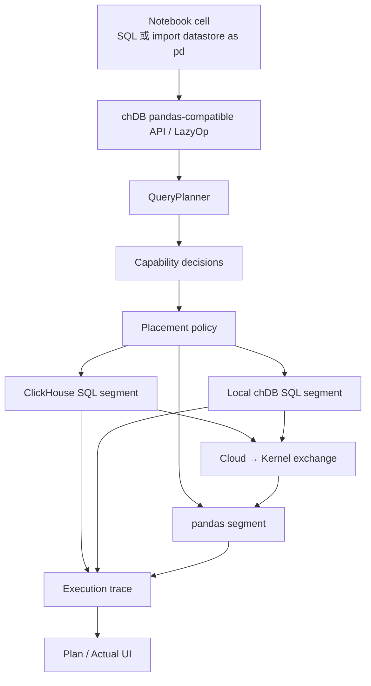

# chDB Generic Compute：ClickHouse Pushdown POC 实施与验证计划

状态：设计稿  
目标仓库：[chdb-io/generic-compute](https://github.com/chdb-io/generic-compute) 与 [chdb-io/chdb](https://github.com/chdb-io/chdb)  
设计基线：generic-compute `8314c67`，chDB `d0a17fb937d`  

本文把 ClickHouse pushdown 拆成多个可独立交付、可测试闭环的版本。第一个公开 POC 不追求完整 pandas 兼容，也不做复杂的成本优化；它必须证明一件事：用户继续写 SQL 或 pandas 风格代码，大数据计算在 ClickHouse 完成，少量不支持的计算回到 notebook kernel，并且系统能解释每一步为什么这样执行。

## 1. POC 验收目标

第一版 POC 只覆盖一个 notebook、一个 execution session 和一个 kernel。完成时，用户可以执行以下流程：

1. 使用 `import datastore as pd` 进入 chDB pandas-compatible API。
2. 从 ClickHouse 取得惰性表或惰性 SQL 结果。
3. 使用 pandas 风格的筛选、派生列、聚合和排序。
4. 将支持的前缀合并成一条 SQL，在 ClickHouse 执行。
5. 将不支持的 `pct_change()` 放在聚合结果回流后执行。
6. 在 Plan 面板看到逻辑算子、执行位置、生成 SQL、未下推原因和实际扫描指标。
7. 从自然语言生成可见、可编辑的 SQL/Python cell，并复用同一套规划和执行路径。

第一版不包含：

- 任意 Python 代码的数据依赖图分析。
- 跨多个 ClickHouse connection 的分布式 join。
- 自动上传任意本地大表。
- Python UDF 下推。
- 生产级鉴权、计费和资源调度。
- 对所有第三方 pandas 库透明兼容。
- 将 `import pandas as pd` 改写为 chDB backend；POC 保留当前 per-cell pandas opt-out 行为。
- backend 选择 UI 和 session 级 `native/chdb` 切换。
- 一个 notebook 创建或连接多个 execution session。
- 多客户端共享同一 session 的产品化体验和隔离验收。

## 2. 当前基线与缺口

generic-compute 当前已经有可复用的骨架：

- `%%sql --engine clickhouse` 可以通过 `clickhouse-connect` 执行远程 SQL。
- `server/app/kernel.py` 已按 session 保存独立 kernel，并在同一 session 内串行执行。
- 多个 WebSocket 可以连接同一个 `KernelSession`。
- `web/src/types.ts` 已有 `ExecutionMeta`、segment 和 explain 的基础类型。
- `web/src/components/ExplainPanel.tsx` 已有查询计划面板。
- AI harness 已支持 live provider 和确定性 fixture。

还缺少的核心能力是：

- DataStore 的 SQL segment 目前在本地 chDB 执行，通过 `remote(...)` 读取 ClickHouse；这不是把整个 SQL segment 发到远程 ClickHouse。
- `QueryPlanner._can_push_op_to_sql()` 只返回布尔值，无法解释为什么能或不能下推。
- kernel 会把执行元数据压缩成单一 segment，不能呈现真实的混合执行计划。

以下是 POC 后演进点，不是当前缺口的验收项：

- 顶层 `import pandas as pd` 当前是 per-cell pandas opt-out。未来可在 kernel 编译前按 session backend 做 AST 改写。
- Web 端目前为每个 notebook 持久化一个 session ID。未来可扩展为一个 notebook 连接多个 session。

## 3. 代码归属

| 能力 | 代码仓库 | 主要文件 |
| --- | --- | --- |
| LazyOp 能力判断、segment 切分、原因码 | chDB | `datastore/query_planner.py` |
| 面向目标引擎的 SQL source 渲染 | chDB | `datastore/sql_executor.py`、source/adapter 相关模块 |
| 可注入的 SQL segment executor | chDB | `datastore/executor.py`、`datastore/core.py` |
| pandas-compatible 惰性远程表入口 | chDB | `datastore/pandas_api.py` |
| session 配置、AST import 改写（POC 后） | generic-compute | `server/app/kernel.py`、`server/app/kernel_bootstrap.py` |
| ClickHouse connection 和远程 executor | generic-compute | 新增 `server/app/pushdown/` |
| WebSocket 执行上下文和元数据清洗 | generic-compute | `server/app/main.py`、`server/app/kernel.py` |
| Plan/Actual UI | generic-compute | `web/src/types.ts`、`web/src/components/ExplainPanel.tsx` |
| 多 session 选择与重连（POC 后） | generic-compute | `web/src/lib/kernel.ts`、notebook state |
| 自然语言生成与 fixture | generic-compute | `server/app/ai/`、`server/tests/fixtures/ai/` |

边界原则：chDB 不感知 notebook、用户、WebSocket 或 secret store；generic-compute 不自行判断 pandas 算子能否编译成 SQL。

## 4. 目标执行链路



未来的 `import pandas as pd` 改写只是在 A 与 D 之间增加 session backend 配置和 kernel AST transformer，不改变 D 之后的 planner、executor 或 trace 协议。

这里要分开两个问题：

1. Capability：这个算子能否表示为 ClickHouse SQL。
2. Placement：这个 SQL segment 应在本地 chDB 还是远程 ClickHouse 执行。

不能把“可编译成 SQL”等同于“已经远程下推”。

## 5. 核心数据结构

### 5.1 POC 运行模型

```text
NotebookDocument 1 ── 1 ExecutionSession
ExecutionSession 1 ── 1 KernelProcess
ExecutionSession 1 ── N DataConnectionRef
```

POC 沿用现有 notebook 到 session ID 的连接方式，不增加 session 创建 API、selector 或多 session 生命周期。pushdown 代码仍通过一个显式上下文取连接和 trace，避免把当前连接散落成无法演进的全局变量：

```python
PushdownContext(
    notebook_id="uk-price-paid-poc",
    session_id="session-01",
    connections={"demo-clickhouse": ConnectionRef(...)},
    placement_policy=PlacementPolicy(...),
    limits=ExecutionLimits(...),
    trace_collector=ExecutionTraceCollector(...),
)
```

限制：

- credential 只通过 `ConnectionRef.secret_id` 解析，不进入 notebook、SQL 文本或 trace。
- POC 的 ClickHouse client 由唯一的 `PushdownContext` 持有并按 `connection_id` 查找。
- POC 继续使用现有 execution lock，在唯一 session 内串行执行。
- query ID 至少包含 session、cell 和 execution ID。
- `PushdownContext` 不作为进程单例 API；未来可自然变成每个 session 一个实例。

POC 后的目标关系为 `NotebookDocument 1 ── N ExecutionSession`、`ExecutionSession 1 ── M ClientConnection`。届时连接池可按 `session_id + connection_id` 隔离，scheduler 创建独立 headless session；这些都不改变本次 POC 的 planner/executor 接口。

### 5.2 Planner 决策

将布尔判断改为结构化结果：

```python
@dataclass(frozen=True)
class PushdownDecision:
    eligible: bool
    reason_code: str
    detail: str


@dataclass(frozen=True)
class PlacementDecision:
    target: str  # clickhouse | chdb | pandas
    connection_id: str | None
    reason_code: str
    detail: str
```

第一版原因码固定为：

| 原因码 | 含义 |
| --- | --- |
| `SUPPORTED_RELATIONAL_OP` | 算子有 ClickHouse SQL 映射 |
| `SINGLE_REMOTE_SOURCE` | segment 中所有远程关系属于同一 connection |
| `PYTHON_CALLABLE` | 包含任意 Python callable，例如 `apply(lambda ...)` |
| `PANDAS_REQUIRED` | pandas-compatible API 暂无 SQL 实现 |
| `LOCAL_ONLY_SOURCE` | 数据源只存在于 kernel |
| `CROSS_CONNECTION` | 同一 segment 引用了多个 connection |
| `DIALECT_UNSUPPORTED` | 当前 ClickHouse SQL renderer 不支持该表达式 |
| `USER_FORCED_NATIVE` | session 或 cell 明确选择原生 pandas |
| `RESULT_SIZE_GUARD` | 预计回流数据超过安全限制 |

### 5.3 Execution Plan/Trace 协议

前端不再从日志文本猜计划。chDB 编译器直接保留 op node 到 SQL fragment 的映射，generic-compute 将它转换为稳定 JSON：

```json
{
  "schemaVersion": 1,
  "phase": "actual",
  "sessionId": "session-01",
  "cellId": "cell-03",
  "executionId": "exec-42",
  "nodes": [
    {
      "id": "n1",
      "kind": "scan",
      "label": "demo.uk_price_paid",
      "target": "clickhouse",
      "reason": {
        "code": "SINGLE_REMOTE_SOURCE",
        "detail": "all relations use demo-clickhouse"
      }
    }
  ],
  "segments": [
    {
      "id": "s1",
      "target": "clickhouse",
      "connectionId": "demo-clickhouse",
      "nodeIds": ["n1", "n2", "n3", "n4"],
      "sql": "SELECT ... FROM demo.uk_price_paid ..."
    }
  ],
  "exchanges": [
    {
      "from": "s1",
      "to": "s2",
      "direction": "cloud_to_kernel",
      "rows": 6,
      "bytes": 192
    }
  ],
  "metrics": {
    "queryId": "gc-session-01-cell-03-exec-42-s1",
    "readRows": 27550000,
    "readBytes": 880000000,
    "resultRows": 6,
    "elapsedMs": 310
  }
}
```

Plan 面板显示 notebook placement plan。ClickHouse 的 `EXPLAIN` 或 `EXPLAIN PIPELINE` 作为远程 segment 的二级详情，不能替代 placement plan。

## 6. 环境准备和基线记录

### 步骤 0.1：准备两个仓库

```bash
git clone https://github.com/chdb-io/generic-compute.git
git clone https://github.com/chdb-io/chdb.git
cd generic-compute
```

generic-compute 本地开发环境：

```bash
cd server
python3.11 -m venv .venv
source .venv/bin/activate
pip install -r requirements.txt
cd ../web
npm ci
```

chDB 本地开发环境：

```bash
cd chdb
python3.12 -m venv .venv
source .venv/bin/activate
python -m pip install --upgrade pip
pip install -r requirements-dev.txt
pip install -e .
```

也可以不创建持久 Python 环境，直接运行：

```bash
cd server
uv run --with-requirements requirements.txt pytest tests -q -m "not slow"
```

验证方法：

- Python 依赖安装成功。
- `npm ci` 没有 dependency resolution error。
- 在设计基线 `8314c67` 上，server fast tests 的实测结果为 `86 passed, 1 skipped, 9 deselected`。

### 步骤 0.2：记录修改前基线

```bash
cd server
uv run --with-requirements requirements.txt pytest tests -q -m "not slow"
cd ../web
npm run build
npm test
npm run lint
```

验证方法：

- 将 commit、Python/Node 版本和结果记录到开发日志。
- POC 新增测试必须通过。
- 修改不能增加新的失败。
- `npm run build` 必须通过。
- 当前 `8314c67` 在本机实测 `npm run build` 通过；`npm test` 有 6 个既有失败，主要与测试进程中的 `localStorage` 不可用有关；lint 有一个既有 `no-unused-vars` error。实现前先确认这些失败是否仍存在并单独处理，不把它们记作 pushdown 回归。

### 步骤 0.3：启动安全的本地栈

```bash
BIND_IP=127.0.0.1 docker compose up --build --wait
```

验证方法：

```bash
curl -fsS http://127.0.0.1:8000/healthz
curl -fsS "http://127.0.0.1:8123/?query=SELECT%201"
curl -fsSI http://127.0.0.1:3000/
```

三个命令都必须返回成功。POC 栈没有生产鉴权，禁止绑定公网地址。

## 7. 迭代 1：结构化决策和真实计划

这一版不改变执行位置，先让系统能准确说明当前发生了什么。

### 实施步骤

1. 在 chDB `datastore/query_planner.py` 增加 `PushdownDecision`。
2. 将 `_can_push_op_to_sql()` 的各个分支改为返回决策和稳定原因码。
3. `ExecutionSegment` 保存每个 op 的 decision，而不是只保存 `sql/pandas` 类型。
4. 为 source、op、segment 和 exchange 分配稳定 ID。
5. 增加结构化 `explain_dict()`；现有文本 `explain()` 只负责渲染该结构。
6. generic-compute `build_execution_meta()` 保留所有 segment，不再折叠成一个 segment。
7. 扩展 `web/src/types.ts` 和 `ExplainPanel.tsx`，显示执行位置、原因码和生成 SQL。

### 自动验证

在 chDB 中新增：

- `datastore/tests/test_pushdown_decisions.py`
- `datastore/tests/test_plan_invariants.py` 的结构断言
- 对应的 SQL snapshot

测试必须覆盖：

- filter、projection、groupby、aggregation、limit 返回 `eligible=True`。
- `apply(lambda ...)` 返回 `PYTHON_CALLABLE`。
- 本地 DataFrame source 返回 `LOCAL_ONLY_SOURCE`。
- 节点顺序、segment 边界、`is_first_segment` 和原因码完整断言。
- 不通过直接调用 `_execute()` 触发执行，使用 `repr()`、`len()` 或完整结果比较。

完成本步骤后运行：

```bash
cd datastore
../.venv/bin/python -m pytest tests/test_pushdown_decisions.py tests/test_plan_invariants.py -q
../.venv/bin/python -m pytest tests/test_property_based_chains.py -q
```

在 generic-compute 中运行：

```bash
cd server
uv run --with-requirements requirements.txt pytest tests/test_kernel.py tests/test_metadata.py -q
cd ../web
npm test -- src/test/explain.test.tsx src/test/pushdown.test.tsx src/test/execmeta.test.ts
npm run build
```

### 人工验证

在 notebook 中定义一个五步惰性链但暂不显示结果。展开 Plan：

- 每个操作出现一次，顺序与代码一致。
- 每个节点都有执行引擎和原因。
- SQL segment 被画成连续的一段。
- pending plan 明确显示尚未执行，不显示伪造的实际指标。

### 交付闭环

输入一个惰性 pandas-style chain，得到可机器断言、可 UI 展示的计划。执行仍与当前版本一致，但“为何下推/为何不下推”已经成为正式接口。

## 8. 迭代 2：远程 ClickHouse SQL segment executor

这一版完成真正的 ClickHouse pushdown，不再让本地 chDB 通过 `remote(...)` 执行同一个 segment。

### 实施步骤

1. chDB 定义可注入的 `SqlSegmentExecutor` 接口。
2. executor 输入为编译后的 SQL、connection ID、query ID 和执行限制。
3. executor 输出 Arrow/pandas-compatible 结果和实际指标。
4. source renderer 增加 target：
   - `target=chdb`：远程表渲染为 `remote(...)`。
   - `target=clickhouse`：同一连接上的表渲染为 `database.table`。
5. 禁止通过正则在最终 SQL 中替换 `remote(...)`。source 节点必须在 SQL 生成阶段按 target 渲染。
6. generic-compute 新增：

```text
server/app/pushdown/
  context.py
  connections.py
  clickhouse_executor.py
  trace.py
```

7. `ClickHouseSegmentExecutor` 从当前唯一的 `PushdownContext` 取得 `clickhouse-connect` client。
8. 远程失败时返回明确错误。第一版不允许静默改成本地 chDB 重跑。
9. query ID 采用：

```text
gc-{session_id}-{cell_id}-{execution_id}-{segment_id}
```

### 自动验证

chDB 单元测试使用 fake executor，验证：

- 完整 SQL segment 只调用一次 executor。
- `target=clickhouse` 的 SQL 包含 `FROM demo.uk_price_paid`。
- SQL 不包含 `remote(`，也不包含密码。
- 远程异常不会静默 fallback。

generic-compute server 测试使用 fake ClickHouse client，验证：

- executor 按 `connection_id` 取得正确 client，不依赖模块级“当前连接”。
- query ID 含 session/cell/execution/segment。
- `rows_read`、`bytes_read`、elapsed 和 result rows 写入 trace。
- trace 不包含密码和 token。

完成本步骤后，先在 chDB 仓库根目录运行：

```bash
cd datastore
../.venv/bin/python -m pytest tests/test_remote_executor_routing.py -q
```

再在 generic-compute 仓库根目录运行：

```bash
cd server
uv run --with-requirements requirements.txt pytest tests/test_pushdown_executor.py -q
```

### 集成验证

先启动 generic-compute Docker 栈，然后让 chDB 测试复用该 ClickHouse：

```bash
cd datastore
TEST_CLICKHOUSE_HOST=127.0.0.1:9000 ../.venv/bin/python -m pytest tests/test_remote_lazy_chain_pushdown.py -q
```

验证 SQL 日志和 query trace：

- 每个全下推 chain 只有一个远程 query ID。
- SQL 包含期望的 `WHERE`、`GROUP BY`、`ORDER BY` 和 `LIMIT`。
- SQL 使用直接表名，不使用 `remote(...)`。
- 结果的列、值和行顺序与 pandas mirror 完整一致。

### 交付闭环

对一个远程表执行 filter → project → groupby → aggregate → sort，ClickHouse 收到一条 SQL，notebook 收到小结果和真实扫描指标。

## 9. 迭代 3：单 session 惰性远程入口

POC 不改变当前 `import pandas as pd` 的 per-cell opt-out 语义，也不增加 backend 设置。需要 pushdown 的示例明确使用：

```python
import datastore as pd
```

### 9.1 惰性表入口

chDB `read_sql_table()` 增加显式的 lazy catalog 协议。generic-compute 将 session connection 暴露为不含明文 credential 的 facade：

```python
import datastore as pd

prices = pd.read_sql_table(
    "uk_price_paid",
    ch,
    schema="demo",
)
```

当 `con` 是 chDB lazy catalog 时，返回 remote `DataStore`；其他 DBAPI/SQLAlchemy connection 继续走现有 pandas 路径。

### 自动验证

Lazy catalog 测试覆盖：

- `read_sql_table()` 不发查询、不物化数据。
- 访问自然执行边界时才调用 executor。
- SQLAlchemy/普通 pandas connection 保持现有行为。
- `import pandas as pd` 的现有 opt-out 行为不发生回归。

完成本步骤后，在 generic-compute 仓库根目录运行现有 kernel 回归测试：

```bash
cd server
uv run --with-requirements requirements.txt pytest tests/test_kernel.py -q
```

在 chDB 仓库根目录运行：

```bash
cd datastore
../.venv/bin/python -m pytest tests/test_lazy_remote_catalog.py -q
```

### 人工验证

在唯一的 POC session 中执行：

```python
import datastore as pd

prices = pd.read_sql_table("uk_price_paid", ch, schema="demo")
print(type(prices).__name__)
```

预期得到惰性 `DataStore`。创建变量时不扫描 `demo.uk_price_paid`；只有显示结果等自然执行边界才触发查询。

### 交付闭环

单个 notebook session 可以用明确的 `import datastore as pd` 创建远程惰性关系，并交给后续统一 planner。POC 不引入 backend 选择和多 session 产品语义。

## 10. 迭代 4：UK Price Paid 端到端 POC

UK Price Paid 是 ClickHouse 官方示例常用数据集。完整数据约 2755 万行，可参考 [ClickHouse getting-started 示例](https://clickhouse.com/blog/common-getting-started-issues-with-clickhouse)；Parquet 文件位于 `https://datasets.clickhouse.com/uk_price_paid.parquet`。

### 10.1 数据准备

修改 `deploy/seed/seed.py`：

1. 创建 `demo.uk_price_paid`。
2. 从官方 Parquet 导入。
3. `UK_PRICE_PAID_LIMIT=0` 表示完整数据；开发环境可限制行数。
4. 在 `docker-compose.yml` 的 seed service 中透传 `UK_PRICE_PAID_LIMIT`。
5. 将 dataset URL、limit 和 schema version 纳入 seed version，保证重复执行幂等。
6. CI 不访问公网，使用从官方数据截取并固定下来的小 fixture。

目标 SQL 形态：

```sql
CREATE TABLE demo.uk_price_paid
ENGINE = MergeTree
ORDER BY (town, date)
AS
SELECT *
FROM url(
  'https://datasets.clickhouse.com/uk_price_paid.parquet',
  Parquet
)
LIMIT {configured_limit}
```

当 limit 为 0 时，seed 代码生成不带 `LIMIT` 的 SQL。

启动完整数据 Demo：

```bash
UK_PRICE_PAID_LIMIT=0 BIND_IP=127.0.0.1 docker compose up --build --wait
```

验证数据：

```bash
docker compose exec -T clickhouse clickhouse-client --query "SELECT count(), min(date), max(date), uniqExact(town) FROM demo.uk_price_paid FORMAT PrettyCompact"
```

验收：

- 完整模式行数应大于 2700 万。
- `min(date)`、`max(date)` 非空。
- `uniqExact(town)` 大于 100。
- 重启 seed 不产生重复数据。

### 10.2 SQL-only 场景

Notebook cell：

```sql
SELECT
    toYear(date) AS year,
    avg(price) AS avg_price,
    count() AS sales
FROM demo.uk_price_paid
WHERE town = 'LONDON'
  AND date >= '2019-01-01'
GROUP BY year
ORDER BY year
```

验收：

- 计划只有一个 ClickHouse segment。
- 生成 SQL 与输入 SQL 一致或只有安全的参数化差异。
- 显示 query ID、read rows/read bytes、result rows 和 elapsed。
- 结果按 year 升序，`sales > 0`，`avg_price > 0`。

### 10.3 Pandas-style 全下推场景

```python
import datastore as pd

prices = pd.read_sql_table("uk_price_paid", ch, schema="demo")
london = prices[prices["town"] == "LONDON"]
london = london.assign(year=london["date"].dt.year)
trend = london.groupby("year", as_index=False).agg({"price": "mean"})
trend = trend.sort_values("year")
print(trend)
```

验收计划：

```text
Scan demo.uk_price_paid      → ClickHouse · SINGLE_REMOTE_SOURCE
Filter town = LONDON         → ClickHouse · SUPPORTED_RELATIONAL_OP
Derive year = toYear(date)   → ClickHouse · SUPPORTED_RELATIONAL_OP
GroupBy year + avg(price)    → ClickHouse · SUPPORTED_RELATIONAL_OP
Sort year                    → ClickHouse · SUPPORTED_RELATIONAL_OP
```

验证：

- 只有一个 ClickHouse query ID。
- 生成 SQL 包含 `WHERE`、`toYear`、`GROUP BY`、`avg` 和 `ORDER BY`。
- 没有 pandas segment。
- 使用同一份小 fixture 跑 pandas mirror，完整比较列、值和行顺序。

### 10.4 SQL + pandas 混合场景

新增惰性 SQL magic：

```sql
%%sql --lazy london_sales --engine clickhouse
SELECT date, town, district, price
FROM demo.uk_price_paid
WHERE town = 'LONDON'
  AND date >= '2019-01-01'
```

该 cell 注册 `RemoteSqlRelation`，不立即拉取全部明细。

Python cell：

```python
import datastore as pd

trend = london_sales.assign(year=london_sales["date"].dt.year)
trend = trend.groupby("year", as_index=False).agg({"price": "mean"})
trend = trend.sort_values("year")
trend["yoy"] = trend["price"].pct_change()
print(trend)
```

预期计划：

```text
1. Remote SQL relation       → ClickHouse
2. Derive year               → ClickHouse
3. GroupBy + avg             → ClickHouse
4. Sort                      → ClickHouse
   Cloud → Kernel exchange   → 少量年度聚合行
5. pct_change()              → pandas · PANDAS_REQUIRED
```

验收：

- ClickHouse 读取明细并只返回年度聚合结果。
- exchange rows 等于远程 segment 返回行数。
- `pct_change()` 是唯一 pandas segment。
- 第一行同比为 null，后续同比值与原生 pandas mirror 一致。
- UI 明确写出未下推原因，不能把整个 cell 标成 Cloud。

### 10.5 明确不下推场景

```python
labels = trend["price"].apply(
    lambda value: "high" if value > 500000 else "normal"
)
print(labels)
```

验收：

- `apply(lambda ...)` 节点执行位置为 pandas。
- 原因码为 `PYTHON_CALLABLE`。
- Plan 提示“任意 Python callable 无法转换为 ClickHouse SQL”。
- 已经完成的远程聚合不被重新执行或拉回明细。

### 自动化闭环

在 chDB 新增完整用户旅程测试：

```text
datastore/tests/journeys/test_generic_compute_uk_price_paid_pushdown.py
```

测试必须镜像完整五步链，不能只测单个 filter 或 groupby。使用固定小 fixture，完整验证结果和计划结构。

在 generic-compute 新增：

```text
server/tests/test_lazy_sql_magic.py
tests/e2e/pushdown-poc.spec.ts
notebooks/pushdown-poc.ipynb
```

完成本步骤后，在 chDB 仓库根目录运行：

```bash
cd datastore
../.venv/bin/python -m pytest tests/journeys/test_generic_compute_uk_price_paid_pushdown.py -q
```

在 generic-compute 仓库根目录运行：

```bash
cd server
uv run --with-requirements requirements.txt pytest tests/test_lazy_sql_magic.py tests/test_pushdown_executor.py -q
cd ../tests/e2e
npm ci
npm test -- pushdown-poc.spec.ts
```

### 交付闭环

这是第一个可以对外演示的版本：SQL、pandas 风格 API 和局部 pandas fallback 共用同一条远程关系、同一个规划器和同一个 Explain UI。

## 11. 迭代 5：自然语言输入

自然语言只生成可见、可编辑的 cell，不直接绕过 planner 执行隐藏 SQL。

### 实施步骤

1. AI context 注入 ClickHouse schema、connection ID 和可用的 pandas-compatible API。
2. 生成结果仍使用现有 typed cell contract：`sql` 或 `python`。
3. SQL-heavy 请求优先生成惰性 SQL cell，再生成 pandas 后处理 cell。
4. 不把 credential、内部 host 或完整数据样本发给模型。
5. 为以下中文 prompt 增加确定性 fixture：

```text
比较 2019～2024 年伦敦每年的平均成交价，计算同比变化并画图。
```

6. fixture 生成：
   - 一个按年度聚合的 ClickHouse SQL/lazy relation。
   - 一个计算 `pct_change()` 的 Python cell。
   - 一个结果图表配置。
7. generated cell 插入 notebook 后，走普通 kernel → planner → executor → trace 流程。

### 自动验证

fixture 模式：

```bash
cd server
AI_MODE=fixture uv run --with-requirements requirements.txt pytest tests/test_ai_harness.py tests/test_ai.py -q
cd ../web
npm test -- src/test/AiPanel.test.tsx src/test/PromptCell.test.tsx src/test/aiReducer.test.ts
```

必须断言：

- 同一个 prompt 生成稳定的 cell 类型和源码。
- SQL 使用 `demo.uk_price_paid` 和正确的日期、城市过滤。
- Python 后处理引用上游绑定变量。
- 生成代码可编辑，不会在用户确认前隐藏执行。
- 执行后的结果和手写 SQL/DataStore 场景一致。
- placement plan 与手写场景一致。
- AI provenance 保留原始 prompt。

Live provider 只做手工 smoke test，不作为必过 CI：

```bash
AI_MODE=live BIND_IP=127.0.0.1 docker compose up --build --wait
```

### 人工验证

1. 输入固定中文 prompt。
2. 检查 AI 生成的 SQL/Python cell。
3. 点击 Insert & run。
4. 确认结果图、同比数值和手写场景一致。
5. 展开 Plan，确认远程聚合和本地同比的边界一致。

### 交付闭环

自然语言、手写 SQL 和手写 DataStore pandas-style 代码最终形成相同的逻辑计划和执行结果，证明 NL 是输入方式，不是另一套不可解释的执行系统。

## 12. POC 后演进：session backend 与多 session

本节只定义兼容方向，不属于 POC 的实施步骤、测试门槛或交付范围。

### 12.1 `import pandas as pd` 的未来改写位置

未来需要提供 pandas backend 选择时，改写放在 generic-compute kernel 内：cell 源码到达 kernel 之后、Python compile 之前。

```text
original cell source
→ read ExecutionSessionConfig.pandas_backend
→ parse AST
→ exact top-level import rewrite
→ compile/execute
```

`pandas_backend=chdb` 时，精确的顶层 `import pandas as pd` 等价为 `import datastore as pd`。设计约束：

- 不修改 notebook 保存的源码。
- 不替换 `sys.modules["pandas"]`。
- 不改写函数体、条件分支、动态 import 或语法失败 cell。
- `import pandas as native_pd` 可作为明确的原生 pandas 入口。
- 当前 `_PerCellPandasOptOut` 到那时再重构为 backend transformer；POC 保持原行为。

为了避免 POC 代码阻碍该演进，planner 从 DataStore/LazyOp 开始工作，不依赖用户最初写的是 `datastore` 还是未来被改写的 `pandas`。

### 12.2 一个 notebook 多 session 的未来模型

```text
NotebookDocument 1 ── N ExecutionSession
ExecutionSession 1 ── 1 KernelProcess
ExecutionSession 1 ── M ClientConnection
ExecutionSession 1 ── N DataConnectionRef
```

未来增加：

- 服务端签发的 `(tenant_id, notebook_id, execution_session_id)` 身份。
- session 创建、连接、重连、关闭和 TTL API。
- 前端 session selector。
- 每个 session 独立的 backend、kernel、connection client 和 trace collector。
- 同一 session 多客户端共享 namespace 和 execution lock。
- scheduler 从 immutable notebook snapshot 创建独立 headless session。

POC 只需保留三个演进接口：

1. executor 通过 `PushdownContext` 取连接，不读取模块级“当前连接”。
2. trace 和 query ID 已带现有 session ID，但 POC 不验证跨 session 隔离。
3. frontend 的 `ExecutionMeta` 不内嵌全局 session 状态，未来可由 session selector 切换数据源。

未来实现多 session 时再增加隔离、并行、重连和 backend 切换测试，不进入当前 POC 的 Definition of Done。

## 13. Demo 查询计划展示

Plan 面板至少提供两个 tab：

### Placement

```text
① Scan demo.uk_price_paid
  ClickHouse · all relations use demo-clickhouse

② Filter town = 'LONDON'
  ClickHouse · filter has a ClickHouse SQL mapping

③ Derive year
  ClickHouse · compiled as toYear(date)

④ GroupBy year + avg(price)
  ClickHouse · aggregation is supported

⑤ Sort year
  ClickHouse · sort occurs after aggregation

Cloud → Kernel · 6 rows / 192 bytes

⑥ pct_change()
  pandas · no SQL mapping in this version
```

### ClickHouse details

- Generated SQL。
- query ID。
- read rows/read bytes。
- result rows/result bytes。
- elapsed。
- 可选的 `EXPLAIN`/`EXPLAIN PIPELINE`。

用户点击未下推节点时，显示：

- 原因码和人类可读解释。
- 是否因为能力不足、数据位置、连接边界或用户配置。
- 可操作建议，例如“先聚合再调用 Python callable”。

## 14. 测试矩阵

| 层级 | 数据 | 验证内容 | 是否允许公网 |
| --- | --- | --- | --- |
| chDB unit | 内存 fixture | decision、segment、SQL rendering、原因码 | 否 |
| chDB journey | UK Price Paid 小快照 | 五步完整链、pandas mirror、plan shape | 否 |
| generic server | fake executor/client | 单 session context、query ID、trace、secret 隔离 | 否 |
| Docker integration | ClickHouse 中的小快照 | 真远程 SQL、Arrow 结果、指标 | 否 |
| Playwright E2E | Docker seed | SQL/DataStore/NL/Explain 完整用户路径 | 否 |
| 手工 Hero Demo | 完整 UK Price Paid | 规模、性能、可解释性 | 是，仅数据导入 |
| 后续规模 Demo | GitHub Events | 自然语言和大规模聚合 | 可选 |

后续混合数据源场景使用 NYC Taxi 大表加本地 zone lookup。ClickHouse 官方示例提供约 300 万行的 NYC Taxi 文件及导入方法，可参考 [chDB JupySQL guide](https://clickhouse.com/docs/chdb/guides/jupysql)。GitHub Events 可用于自然语言 Hero Demo，但不进入必过 CI；可用数据集见 [ClickHouse Demos](https://clickhouse.com/demos)。

## 15. 每次迭代的统一完成标准

每个版本合并前必须满足：

- 功能有一个从输入到结果的完整用户场景。
- 结果与 SQL 基准或 pandas mirror 完整一致。
- 计划的节点、顺序、segment、placement 和原因码均有断言。
- 生成 SQL 有精确片段断言。
- 远程执行有 query ID 和实际扫描指标。
- 无明文 credential 出现在 SQL、日志、trace、notebook 或前端 frame。
- 远程错误不静默 fallback。
- 单个 POC session 从干净 kernel 启动并稳定复现结果。
- chDB planner 改动通过 property-based chain sweep。
- generic-compute server tests、web build 和新增的 E2E 场景通过。
- Demo notebook 从空 session 顺序执行可以成功，不能依赖开发者残留变量。

## 16. 推荐交付顺序

| 版本 | 用户可见能力 | 独立验收结果 |
| --- | --- | --- |
| 0.1 | 结构化 Explain | 能准确解释当前 chDB/pandas segment |
| 0.2 | 真远程 SQL executor | 五步链在 ClickHouse 以一条 SQL 执行 |
| 0.3 | `import datastore as pd` + lazy table | 单 session 中以 pandas 风格构建远程惰性关系 |
| 0.4 | UK Price Paid 混合执行 | 远程聚合 + 本地 `pct_change()` + 完整计划 |
| 0.5 | 自然语言输入 | NL 生成同一执行链路的可编辑 cells |

对外展示的第一个版本包含 0.1～0.5，其中自然语言只承诺一个 fixture 可稳定复现的场景。整个 POC 固定为一个 notebook、一个 session、一个 kernel。session backend 选择和多 session 产品体验属于 POC 后路线图。
