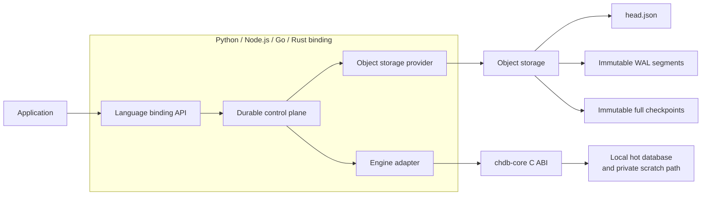

chDB Durable lets an embedded chDB database recover across process restarts, machines, and ephemeral jobs.

It is not a remote database or a live copy of the chDB data directory. Queries and writes still run in a local chDB process. Object storage holds the recoverable state through the last successful `flush()` or `checkpoint()`: a full checkpoint followed by a statement WAL.

For the cross-binding contract, see the [Durable V1 protocol](/chdb/durable/protocol-v1). For use cases and Python examples, see the [durable agent memory cookbook](https://github.com/chdb-io/cookbook/tree/main/durable-agent-memory).

## How it works {#how-it-works}



The design has three layers:

- **chdb-core** runs queries and provides the C ABI for query analysis, database backup, and restore.
- **Language bindings** handle storage providers, credentials, WAL buffering, checkpoint orchestration, leases, CAS, fencing, retries, and resource cleanup.
- **The V1 protocol** defines the object layout, `head.json`, WAL format, state transitions, error categories, and behavior shared by every binding.

Object storage holds the recovery state. The local MergeTree data directory remains the hot working copy.

## Durability boundaries {#durability-boundaries}

| Operation | Result |
| --- | --- |
| `query()` | Runs one read-only statement; nothing is added to the WAL |
| `execute()` | Runs one mutation locally and appends it to the in-memory WAL buffer; it is not durable yet |
| `flush()` | Uploads a WAL segment and commits it to `head.json` with CAS; success establishes a durability boundary |
| `checkpoint()` | Creates a full database backup, publishes it as the new base, and clears the WAL list in the manifest |
| `open()` | Reads the head, restores the base, then replays WAL segments in order |
| `close()` | Stops new operations, flushes, releases the lease, and cleans up local resources |

If an application promises that a successful request can be recovered on another machine, it must wait for `flush()` before returning success.

## Consistency and failures {#consistency}

V1 is a single-writer protocol. A writer acquires a lease in `head.json` through an atomic compare-and-swap. The lease generation and ETag fence stale writers. Read-only openers do not acquire a lease.

Checkpoints and WAL segments use unique, immutable keys. Only `head.json` is mutable, so a successful upload followed by a failed head CAS leaves the previous recovery state intact.

A storage timeout does not prove that a write failed; the provider may have committed it before the response was lost. The binding rereads the object and checks the key, sequence, size, SHA-256 digest, and lease ownership. If it still cannot prove the outcome, it returns `commit_ambiguous` rather than reporting success.

## Upgrade compatibility {#upgrade-compatibility}

Durable V1 makes three independent backward-compatibility promises:

- **C ABI:** later chdb-core releases keep published symbols, signatures, and semantics. Structs grow only at the end, and existing enum and flag values are never renumbered. This allows headers and `libchdb` from different releases to negotiate safely.
- **Backup archives:** later chdb-core releases restore V1 full backups created by earlier releases. If the archive format must break compatibility, core increments `backup_format` instead of allowing RESTORE to fail unexpectedly.
- **Durable protocol:** later bindings continue to read V1 objects and preserve the meaning of frozen fields and state transitions. New requirements use a protocol version or named feature, so an older reader can fail closed.

These promises are specified and tested separately. A new release must support the old ABI, old full backups, and old Durable objects. The reverse is not guaranteed: an older release does not have to understand a future format or feature.

Bindings do not require `head.engine.version` to match the running engine exactly. They use explicit compatibility fields:

```text
backup_format > reader baseline   -> engine_incompatible
running_version < min_reader      -> engine_incompatible
otherwise                         -> open
```

## V1 capabilities {#v1-capabilities}

- One chDB database per Durable object.
- One writer and any number of read-only openers.
- Full checkpoints with statement WAL replay.
- S3 and other object stores with atomic conditional create and replace.
- Size and SHA-256 verification for checkpoints and WAL segments.
- Engine compatibility checks based on `backup_format` and `min_reader`.
- A shared object format and error model across language bindings.

## V1 boundaries {#v1-boundaries}

V1 does not support:

- incremental checkpoints;
- Parquet or data WALs;
- multiple writers, multiple databases per object, or cross-object transactions;
- global state outside the database, including UDFs, access entities, and named collections;
- backups scoped to selected tables, partitions, or time ranges;
- remote garbage collection, object destruction, older engines reading newer archives, or migration across backup formats.

The statement WAL re-executes SQL during recovery. Mutations that use `now()`, `rand()`, mutable external data, or similar nondeterministic inputs may produce a different result when replayed. Materialize those values as SQL literals, or take a checkpoint after the operation.

The chdb-core lifecycle used by V1 allows one active data path per process. A process cannot open Durable objects with different scratch paths at the same time; use separate processes for parallelism.

## Rollups and retention {#rollup-and-retention}

Durable handles recovery, not application-level aggregation. An application may build hourly or daily summary tables with SQL or materialized views, and Durable will preserve the database state captured by a checkpoint.

V1 does not roll up raw data automatically or checkpoint selected tables or partitions. `checkpoint()` always runs a full `BACKUP DATABASE`.

A local TTL limits the logical contents of the current database. V1 does not delete checkpoints and WAL segments replaced by a newer head, so it does not by itself enforce a physical retention period, deletion policy, or cost ceiling in object storage.

## Binding status {#binding-status}

Status as of September 4, 2026:

| Component | Status |
| --- | --- |
| chdb-core | [PR #202](https://github.com/chdb-io/chdb-core/pull/202) is merged; [v26.7.2-rc.2](https://github.com/chdb-io/chdb-core/releases/tag/v26.7.2-rc.2) provides the backup, restore, and query-analysis C ABI |
| Python | [`chdb.durable`](https://github.com/chdb-io/chdb/pull/616) shipped in v4.3.0; the implementation predates the frozen V1 protocol and still needs full V1 conformance work |
| Node.js | [PR #90](https://github.com/chdb-io/chdb-node/pull/90) implements the pure TypeScript control plane; the native adapter and npm release are still pending |
| Go | Planned against the same core ABI and V1 conformance suite |
| Rust | The Session and path lifecycle comes first, followed by the same Durable V1 protocol |

A binding released later still implements V1; release order does not define a new protocol version.

## Roadmap {#roadmap}

The immediate work is to publish the V1 fixtures and scenarios, then bring Python, Node.js, and Go through the same cross-binding conformance suite. Rust joins after its Session model is ready.

V2 candidates include portable incremental checkpoints, Parquet or data WALs, reachability-aware garbage collection, global-state recovery, and migration across backup formats. Selective checkpoints and general rollup primitives need a separate proposal that distinguishes recovery mechanics from application aggregation policy.
